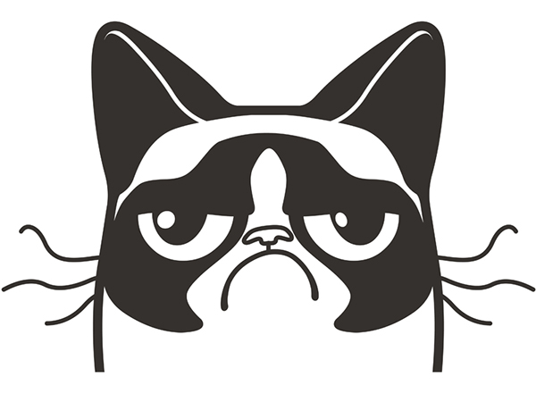
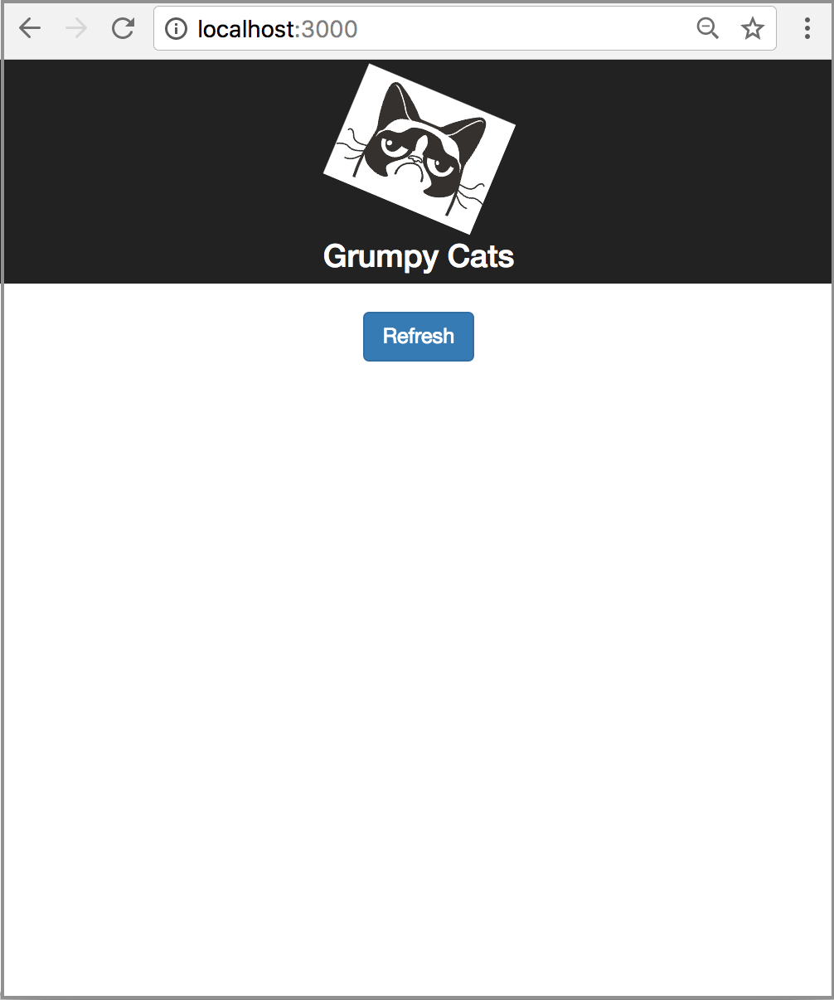

<p align="center">
  <a href="https://github.com/samdengler/grumpy-cats" align="center">
    
  </a>
</p>
<p align="center">
https://www.behance.net/gallery/20124899/Grumpy-Cat-Logo
</p>


# Grumpy Cats - Local Serverless Development Example

Example code demonstrated in [AWS re:Invent 2017: Local Serverless Development using SAM Local (DEM77)](https://www.youtube.com/watch?v=oGawhLx3Dxo)

## Installation

### Prerequisites

* Install [AWS SAM Local](https://github.com/awslabs/aws-sam-local)
* Install [Node.js (includes npm)](https://nodejs.org)

### Install Dependencies

```
npm install
npm --prefix ./api install ./api
npm --prefix ./client install ./client
```

## Start API and Client Application

```
npm start
```

This will launch a web browser to [http://localhost:3000/](http://localhost:3000/)

<p align="center">
  
</p>


Click the **Refresh** button to update the client with a random Grump Cat picture from [api/rss.xml](api/rss.xml). Updates to the [api](api/) or [client](client/) code can be made without restarting the Node.js process.
